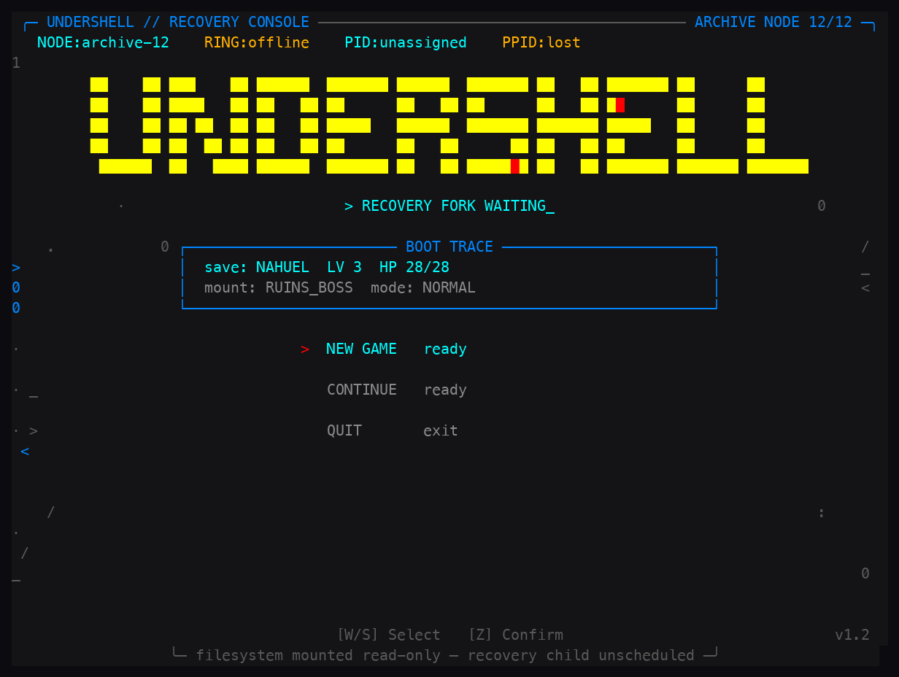
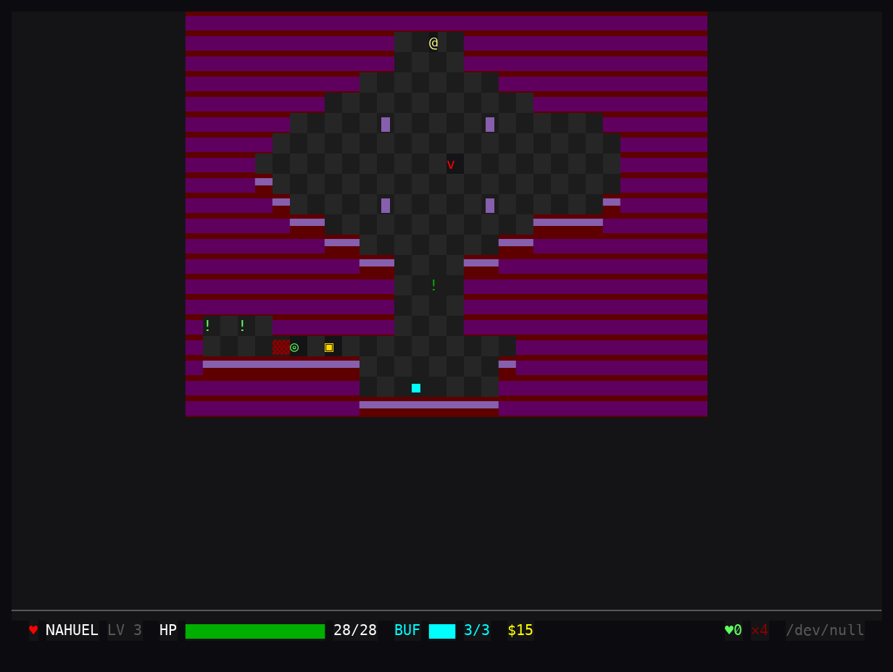

<div align="center">



# 👾 UNDERSHELL

**Un RPG de terminal inspirado en Undertale, ambientado dentro de un sistema operativo moribundo.**


-orange?style=flat-square)


</div>

---

## Qué es esto

UNDERSHELL es un RPG de terminal con alma de Undertale: exploración con puzzles, combate por puzzles-protocolo, esquiva estilo *bullet-hell* y finales ramificados. 100% Python, 100% terminal.

- 🗺️ Exploración con puzzles: empuja bloques de datos, activa interruptores, rota nodos de router y resuelve cadenas de protocolos para abrir rutas.
- ⚔️ Combate como máquina de estados: cada ACT es un paso de reparación con marcadores `>`, `OK` y `^C`; nada de adivinar a ciegas.
- 🎯 Bullet-hell: mueve tu "alma" para esquivar patrones de balas que siguen reglas legibles (cada enemigo te avisa de su RULE/READ).
- 🤝 Ruta pacifista o genocida: perdonar siempre es viable.
- 🌳 Finales ramificados: Pacifista, Genocida y dos Neutrales.
- 🆔 Sistema de identidad: el juego rastrea tu `PPID` y la historia reacciona a ello.

## 📖 La historia

Despiertas como un proceso hijo en un sistema operativo que se apaga. La consola de recuperación está esperando tu *fork*, el filesystem está montado en solo lectura y tu PID aún no tiene asignación. Cada monstruo que encuentras es en realidad un **proceso abandonado** con su propio arco, atrapado en un sistema que ya nadie mantiene. Puedes repararlos, perdonarlos… o terminarlos. La historia rastrea tu `PPID` y reacciona a lo que eres y a lo que haces, y cada final consume tu guardado: cada decisión es definitiva.

## 🎮 Cómo se juega

### Exploración

| Tecla | Acción |
| --- | --- |
| `WASD` / Flechas | Moverse (camina contra un bloque para empujarlo) |
| `Z` / `Enter` / `E` | Interactuar (carteles, NPCs, interruptores, guardado) |
| `I` / `Tab` | Menú de pausa (estado, inventario, ayuda) |
| `ESC` | Salir (autoguarda en el mundo exterior) |

### Combate

| Tecla | Acción |
| --- | --- |
| `←` / `→` | Navegar el menú principal |
| `↑` / `↓` | Navegar submenús (ACT, ITEM, BUF) |
| `Z` / `Enter` | Confirmar / avanzar texto |
| `X` | Cancelar / volver |
| `WASD` / Flechas | Mover el alma durante el bullet-hell |
| `ESC` | Salir |

## 🚀 Cómo ejecutar

Requisitos: Python 3.11+, terminal con 256 colores y mínimo 80x24.

```bash
python3 -m venv .venv
source .venv/bin/activate
pip install -r requirements.txt
# Sonido opcional:
pip install -r requirements-audio.txt

python3 main.py
# o, con el lanzador incluido:
./undertale
```

## 📸 Captura

<div align="center">

</div>

## 🛠️ Bajo el capó

- **Python 3.11+** con `curses` — solo librería estándar para el núcleo del juego.
- `pygame` opcional para el audio (corre en silencio sin él).
- Assets de audio (WAV) generados proceduralmente en el primer arranque, incluidos en `assets/`.
- Sistemas separados: motor, exploración, combate, monstruos, finales, progresión y guardado.

## 📦 Créditos

Hecho por [@gavilanbe](https://github.com/gavilanbe). Uno más de mi colección de juegos de terminal. 💻

## 📄 Licencia

[MIT](LICENSE)
